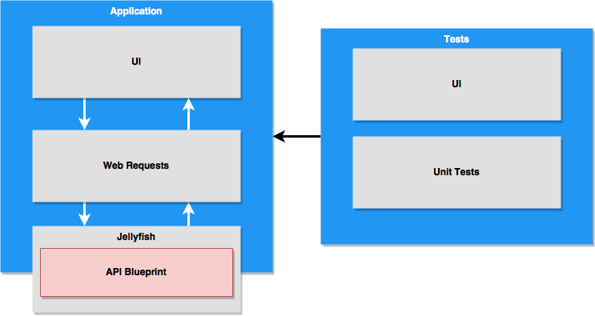
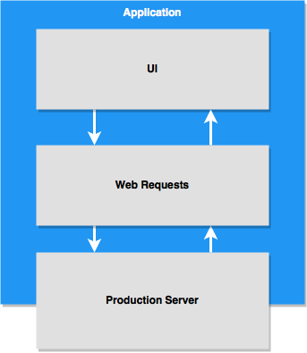

# Jellyfish

[](https://gitlab.com/darkcl/JellyfishKit/commits/master) [](https://darkcl.gitlab.io/JellyfishKit/)

## What is this?

Jellyfish is a library that parse `.api` files and stub all web request according to the file contents.

## TODO

- [x] Read `.api` files and stub requests
- [x] Custom matching handler
- [ ] Provide options to match json schema

## Vision

<p align="center">
  
</p>

When in testing environment, `Jellyfish` should serve as api endpoint for the app.

`UI Tests` and `Unit Tests` don't need to stub web request with this framework.

<p align="center">
  
</p>

As in production environment, we can just remove `Jellyfish` and the app should make request to production server and perform normally.

## Dependency

- [Swifter](https://github.com/httpswift/swifter)
- [URITemplate](https://github.com/kylef/URITemplate.swift)

## Usage

Start a stub with `.apib` file

```swift
import Jellyfish

var jellyfish: Jellyfish = Jellyfish()

jellyfish.stub(docPath: Bundle.main.path(forResource: "testing_normal_blueprint", ofType: "apib")!)

```

Stop the stub

```swift

jellyfish.stop()

```

When using `URLSessionConfiguration`, you need to call `.jellyfishConfiguration`

For example, when use with `Alamofire`

```swift

import Alamofire
        
sessionManager = Alamofire.SessionManager(configuration: .jellyfishConfiguration)

sessionManager.request("https://example.com/message").responseString { result in
    print("==================Alamofire")
    print(result.description)
}

```

You can override default matcher function with `addMatcher(to:)`

```swift

jellyfish.addMatcher(to: "/message") { req in
  let str: String = "This is a message"
  return APIResponse(headers: ["Server": "Custom Handler"], responseCode: 200, body: str.data(using: .utf8)!)
}

```
